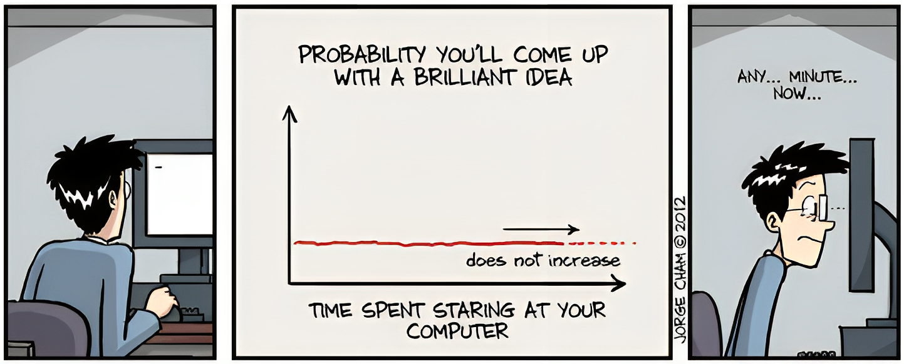

  

  

    
    
    
    
  

## About Me

I'm a **Robotics Researcher** from Dhaka, Bangladesh, passionate about building intelligent, adaptive robotic systems. I hold a **B.Sc. in Computer Science and Engineering** from North South University, where my undergraduate thesis focused on an **Autonomous Obstacle Avoiding Exploring Robot (AOAVER)** for search-and-rescue scenarios.

Currently, I work at the **NSU Intelligent Robotics (NIRO) Lab**, exploring how machine learning can improve coordination and decision-making in multi-robot systems.

## Research Interests

- Swarm Robotics & Multi-Agent Systems
- Deep Reinforcement Learning for Autonomous Agents
- Computer Vision & Perception
- CAD-Based Robotic Design & Embedded Systems
- Motion Planning & Autonomous Navigation

## What I'm Working On

- **Research Assistant** at NIRO Lab - studying centralized and decentralized swarm robotics architectures.
- **Teaching Assistant** for *Introduction to Robotics* courses at North South University.
- Designing educational robotics platforms and hexapod locomotion systems.

